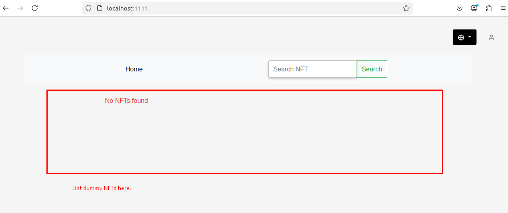

---

## Tech Stack 💻

---

 


### How To Run :

1. Clone the repository

```bash
Make sure you are on Node version 10.x (recommended)
```
2. Go to the project directory and install dependencies.

```bash
npm install
```

3. Start the project

```bash
npm start
```


### Task :

Generate several fake NFT products and display them on the homepage.
<div align="center">

</div>